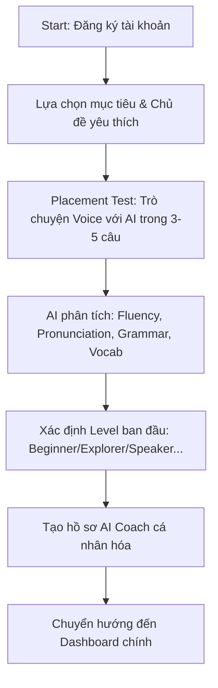
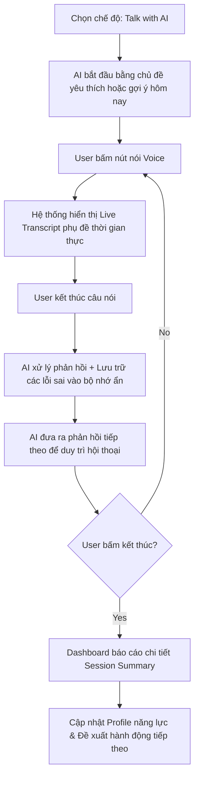
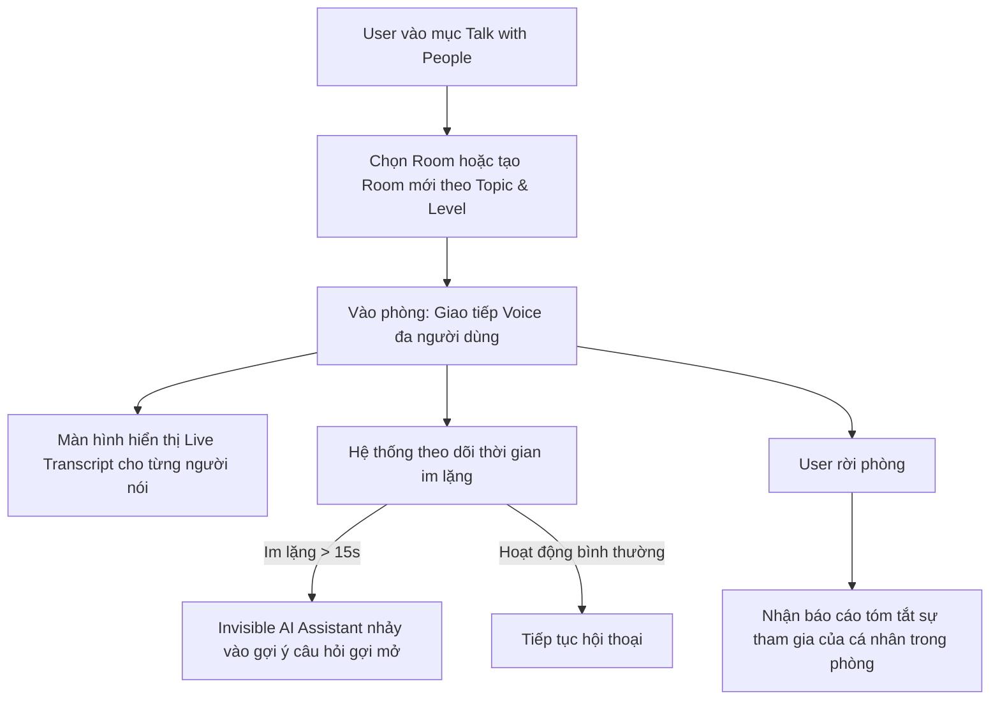

# Product Requirements Document (PRD) - TalkWithMe

Nền tảng học tiếng Anh giao tiếp thế hệ mới tập trung vào trải nghiệm giao tiếp tự nhiên thông qua AI Coach, các bài học tình huống thực tế và phòng trò chuyện cộng đồng kết hợp công nghệ Voice-to-Text (Real-time Script).

---Tôi muốn sử dụng Angular + FastAPI + Postgres + Redis

## 1. Tổng quan dự án (Project Overview)

### Tuyên bố sứ mệnh (Vision Statement)
> **"Không dạy tiếng Anh hàn lâm. Chỉ giúp bạn giao tiếp tự nhiên và tự tin hơn thông qua thực hành thực tế."**

TalkWithMe loại bỏ các phương pháp học truyền thống (ngữ pháp khô khan, luyện thi IELTS/TOEIC, bài tập trắc nghiệm khổng lồ) để tập trung hoàn toàn vào **giao tiếp (Communication)**. Người dùng học bằng cách trò chuyện, nhập vai và tương tác với AI cùng người dùng khác.

### Giá trị cốt lõi (Core Values)
1. **Communication-First**: Mọi tính năng phải trả lời được câu hỏi: *"Tính năng này có giúp người dùng nói nhiều hơn và giao tiếp tốt hơn không?"*
2. **Contextual Learning**: Học từ vựng và ngữ pháp trực tiếp thông qua ngữ cảnh hội thoại, không học vẹt.
3. **Low Barrier to Entry**: Giảm thiểu áp lực tâm lý sợ nói sai thông qua Live Transcript (phụ đề thời gian thực) và phản hồi mang tính xây dựng của AI.
4. **Gamified Progress**: Chuyển đổi các bài học thành nhiệm vụ hàng ngày (Missions) và thử thách (Challenges) để duy trì động lực.

---

## 2. Feature Map & Phân nhóm phạm vi (Scope Division)

Để dự án có thể bắt đầu nhanh chóng và hiệu quả, các tính năng được phân loại thành 3 nhóm chính:
* **MVP (Minimum Viable Product)**: Các tính năng cốt lõi bắt buộc phải có để chạy thử nghiệm và xác thực mô hình.
* **Phase 2 (Tối ưu & Mở rộng)**: Nâng cao trải nghiệm người dùng, bổ sung tương tác nhóm.
* **Nice-to-Have (Tương lai)**: Các tính năng nâng cao, tối ưu hóa sâu bằng AI và thương mại hóa.

### Bảng phân nhóm tính năng (Feature Scope Table)

| Khu vực chức năng | Tính năng chi tiết | MVP | Phase 2 | Nice-to-Have |
| :--- | :--- | :---: | :---: | :---: |
| **Onboarding & Level** | Placement Test (5 phút trò chuyện với AI để xếp lớp) | | **X** | |
| | Đăng ký/Đăng nhập cơ bản & Chọn Level ban đầu thủ công | **X** | | |
| | Hệ thống Level (Beginner $\rightarrow$ Explorer $\rightarrow$ Speaker $\rightarrow$ Communicator $\rightarrow$ Fluent) | **X** | | |
| **🤖 TALK WITH AI** | Cá nhân hóa AI Coach (ghi nhớ sở thích, điểm yếu, goal của user) | **X** | | |
| | Voice Chat + Live Script (Hội thoại thoại + Phụ đề thời gian thực) | **X** | | |
| | Post-Conversation Feedback (Nhận xét ngữ pháp, phát âm sau hội thoại) | **X** | | |
| | Roleplay Scenarios (Nhập vai tình huống: Sân bay, Khách sạn,...) | **X** | | |
| **📚 PRACTICE** | Scenario-based Lessons (Bài học theo tình huống giao tiếp thực tế) | **X** | | |
| | Useful Expressions (Mẫu câu thông dụng ăn liền theo bài học) | **X** | | |
| | Speaking Challenge (Thách thức nói theo mẫu câu vừa học) | **X** | | |
| **👥 TALK WITH PEOPLE**| Voice Chatrooms (Phòng thoại tự do từ 3 - 5 người theo chủ đề) | | **X** | |
| | Live Script trong phòng chat cộng đồng (hiển thị ai đang nói gì) | | **X** | |
| | Invisible AI Assistant (AI hỗ trợ mồi chủ đề khi phòng bị im lặng) | | **X** | |
| | AI Gợi ý mẫu câu cá nhân hóa (chỉ hiện cho từng user khi bí từ) | | | **X** |
| **🎯 GAMIFICATION** | Daily Missions (Nhiệm vụ hàng ngày để nhận XP) | **X** | | |
| | Quick Response Challenge (Thử thách phản xạ nhanh 5s) | | **X** | |
| | Bảng xếp hạng (Leaderboard) & Hệ thống Huy hiệu (Badges) | | **X** | |
| **📊 TRACKING** | Communication Skills Profile (Fluency, Listening, Vocab, Speed, Pronunciation) | **X** | | |
| | Lịch sử hội thoại & Xem lại lỗi sai (Review Dashboard) | **X** | | |

---

## 3. Luồng trải nghiệm người dùng (User Flows)

Dưới đây là sơ đồ Mermaid thể hiện các luồng trải nghiệm chính trong ứng dụng.

### Luồng Onboarding & Xếp Level (Phase 2)


### Luồng hội thoại với AI Coach (MVP)


### Luồng phòng chat cộng đồng (Phase 2)


---

## 4. Kiến trúc kỹ thuật & Đề xuất API bên thứ 3 (Technical Stack & API Proposals)

### Bộ công nghệ chính (Selected Tech Stack)
* **Frontend**: **Angular** (TypeScript, RxJS, Angular Signals, Component Architecture).
* **Backend**: **FastAPI** (Python 3.11+, Async/Await, Pydantic, WebSockets native, SQLAlchemy 2.0 / SQLModel).
* **Database**: **PostgreSQL** (Lưu trữ quan hệ: Users, Lessons, History, Progress, Gamification).
* **Cache & Realtime**: **Redis** (Lưu Cache, Session, Pub/Sub cho WebSockets phòng chat realtime).

---

### Đề xuất API & Công cụ bên thứ 3 (Gói Miễn Phí / Free Tier Best Options)

| Phân loại | Công nghệ / Services | Chi phí | Ưu điểm & Ứng dụng trong TalkWithMe |
| :--- | :--- | :---: | :--- |
| **LLM (Trí tuệ nhân tạo)** | **Google Gemini API** (`gemini-2.0-flash` / `gemini-1.5-flash`) | **FREE** (Miễn phí qua Google AI Studio: 15 RPM, 1M TPM) | Độ trễ cực thấp (rất phù hợp hội thoại voice), bộ nhớ context lớn, hỗ trợ tiếng Việt & tiếng Anh rất tự nhiên. |
| | **Groq API** (Llama 3.1 8B / 70B) | **FREE** (Generous Free Tier) | Tốc độ sinh text siêu nhanh (~300 tokens/s), cực kỳ thích hợp cho Quick Response Challenge 5s. |
| **Speech-to-Text (STT)** | **Browser Web Speech API** (`SpeechRecognition`) | **100% FREE** | Chạy trực tiếp trên trình duyệt (Client-side), độ trễ = 0, không tốn chi phí server cho Live Script thời gian thực. |
| | **Groq Whisper API** (`whisper-large-v3-turbo`) | **FREE** (Gói miễn phí của Groq) | Nhận diện giọng nói chuẩn xác vượt trội khi user phát âm chưa chuẩn hoặc trình duyệt không hỗ trợ Web Speech. |
| | **Faster-Whisper** (Library Python) | **100% FREE** (Open Source) | Chạy nội bộ trên backend FastAPI (CPU/GPU), không phụ thuộc bên thứ 3. |
| **Text-to-Speech (TTS)** | **Edge-TTS** (Thư viện Python `edge-tts`) | **100% FREE** | Sử dụng hệ thống giọng nói Neural chất lượng cao của Microsoft Edge (tự nhiên như người thật), không cần API Key, không giới hạn ký tự. |
| | **Browser Web Speech API** (`SpeechSynthesis`) | **100% FREE** | Phát âm thanh tức thì trên máy user không qua server. |
| | **Google Cloud TTS / ElevenLabs** | **Free Tier** | ElevenLabs: 10,000 ký tự/tháng free (giọng đọc cực hay). Google TTS: 4 triệu ký tự/tháng free. |
| **Realtime Chatroom** | **FastAPI Native WebSockets + Redis Pub/Sub** | **100% FREE** | Tận dụng sẵn FastAPI & Redis backend, không cần mua service thứ 3 như Pusher hay Ably. |

---

## 5. Cấu trúc cơ sở dữ liệu (Database Schema Draft)

Dưới đây là thiết kế các bảng dữ liệu cốt lõi cho phiên bản MVP:

### User Profile
```json
{
  "id": "uuid",
  "email": "string",
  "display_name": "string",
  "level": "enum [Beginner, Explorer, Speaker, Communicator, Fluent]",
  "xp": "integer",
  "goals": ["string"],
  "favorite_topics": ["string"],
  "ai_coach_memory": {
    "strengths": "string",
    "weaknesses": ["string"],
    "repeated_mistakes": ["string"],
    "notes": "string"
  },
  "skills_rating": {
    "fluency": 0,
    "listening": 0,
    "vocabulary": 0,
    "response_speed": 0,
    "pronunciation": 0
  }
}
```

### Lesson (Bài học tình huống)
```json
{
  "id": "uuid",
  "title": "string",
  "scenario_description": "string",
  "level": "enum",
  "useful_expressions": [
    {
      "phrase": "string",
      "meaning": "string",
      "example": "string"
    }
  ],
  "example_dialogue": [
    {
      "speaker": "AI | User",
      "text": "string"
    }
  ],
  "mission_requirements": ["string"]
}
```

### Conversation History (Lịch sử hội thoại)
```json
{
  "id": "uuid",
  "user_id": "uuid",
  "type": "enum [AI_Coach, Scenario_Practice, People_Room]",
  "started_at": "datetime",
  "duration_seconds": "integer",
  "transcript": [
    {
      "timestamp": "datetime",
      "sender": "string",
      "text": "string",
      "audio_url": "string",
      "corrections": [
        {
          "original": "string",
          "suggested": "string",
          "rule_violated": "string"
        }
      ]
    }
  ],
  "summary": {
    "overall_feedback": "string",
    "strengths": ["string"],
    "improvements": ["string"],
    "new_words_learned": ["string"]
  }
}
```

---

## 6. Kế hoạch triển khai & Xác thực (Implementation Plan)

### Tuần 1: Thiết lập & Core Service
* Khởi tạo dự án Frontend & Backend.
* Tích hợp thành công Web Audio API thu âm đầu vào.
* Kết nối API Speech-to-Text (STT) và Text-to-Speech (TTS) cơ bản để chuyển voice sang text và ngược lại.
* Xây dựng giao diện UI ban đầu (Premium UI/UX, Glassmorphism, Dark mode).

### Tuần 2: Tính năng AI Coach & Live Script (MVP Core)
* Kết nối LLM (Gemini API) với System Prompt thiết lập cho AI Coach.
* Thực hiện truyền phát text theo thời gian thực (streaming response) từ AI.
* Triển khai màn hình chat Voice + Live Transcript đồng bộ.
* Thiết lập module chấm lỗi ngữ pháp/từ vựng ẩn (Sau hội thoại mới hiện).

### Tuần 3: Lessons & Gamified Missions
* Xây dựng dữ liệu bài học mẫu theo các Scenario (Daily life, Work, Travel).
* Triển khai hệ thống Level, XP và Daily Missions.
* Hoàn thiện màn hình báo cáo kết quả sau hội thoại (Session Summary Dashboard).

### Tuần 4: Test thử nghiệm & Sửa lỗi (Verification)
* Thử nghiệm thực tế với 10-20 người dùng thử.
* Đánh giá độ trễ của âm thanh và độ chính xác của Live Script.
* Tối ưu hóa prompt để AI Coach trò chuyện mượt mà, tự nhiên và phản hồi nhanh hơn.
